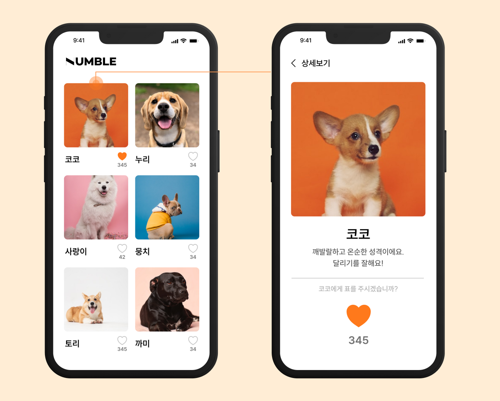
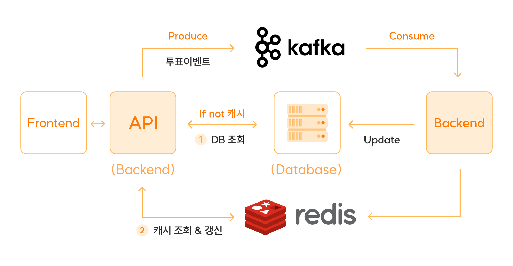
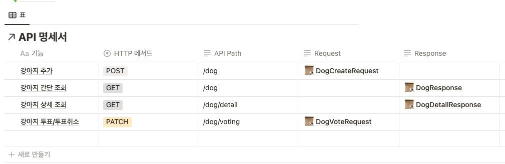

# 📨 vote-dog (Numble)
- - -
## 🐶 강아지 인기투표 API 만들기.

### ⚒️ 요구사항 수립
- - -

#### 기본적으로 다음과 같은 기능을 구현한다.
- 강아지 투표 목록 조회
- 강아지 투표 목록 상세 조회
- 강아지 추가
- 강아지 투표 / 투표 취소

추가로 Kafka를 통한 이벤트처리, Redis를 통한 캐시처리를 구현한다.

### 🏹 기능 목록
- - -
1. 강아지 목록을 조회하는 API
    - [x]  페이지네이션 구현
    - [x]  DB에 강아지의 레코드 PK, 이름, 사진, 간단한 설명과 현재 득표수 정보를 포함
2. 강아지의 상세 정보 조회 API
    - [x]  DB에 강아지의 레코드 PK, 이름, 사진, 간단한 설명과 현재 득표수 정보를 포함
    - [x]  Redis에 캐시된 정보가 있을 경우, Redis에서 가져오고, 없다면 DB에서 데이터를 불러와서 Redis에 저장한 뒤 응답
3. 투표하기 / 투표취소 API
    - [x]  요청에는 강아지의 레코드 PK가 포함되어 백엔드에서 어떤 강아지에 투표 +1 를 해야할지 알도록 구현
    - [ ]  요청이 들어오면 Kafka로 이벤트를 Produce 해서 강아지의 PK 값과 투표 또는 투표 취소 구분값을 같이 전송
        - Kafka 환경 세팅 + 작업은 시도했으나, 이슈 해결 실패.
    - [ ]  HTTP 요청 헤더의 IP를 이용해 중복 투표 방지를 위한 기능 구현
        - IP를 가져오기까지는 했으나 시간 부족으로 구현 실패
4. 투표 처리
    - [ ]  Spring에서 Kafka Cousumer를 구현하여 Produce한 이벤트를 전달받음.
        - Kafka 환경 세팅 + 작업은 시도했으나, 이슈 해결 실패.
    - [x]  이벤트 내용을 통해 DB에 강아지 투표 값 업데이트
    - [x]  DB에서 업데이트되면 Redis에서도 업데이트 된 강아지의 정보만 새로운 득표 수와 함께 업데이트

### 📄 API 명세서
- - -

